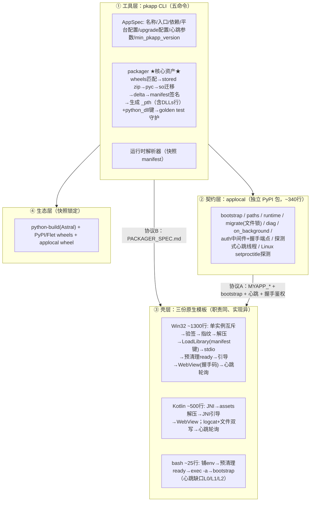

# pkapp 打包方案 · 落地文档 v8.4（v8.0 定稿 + §〇 复核补丁 + 复核二轮一致性补丁 + ★同步补丁：SHELL_PROTOCOL v1.2★ + ★v8.3：ship 六命令★ + ★v8.4：Android 壳 M2 落地 + package 终产物命令★）
> **v8.4 动作**（Android 壳化 M2 落地：设计→真机验证，零架构改动，风险计数维持 26）：
> ① `pkapp build android`（★v8.4b 平台位置参数★）落地：android spk = manifest+signature+**site-packages/**+app/+dist/（修正早期"APK 只放解释器件"口径——pip 依赖随应用版本走必须进 spk，APK 只放解释器级 runtime）；`runtime.lock [runtime.android]` 指向 flet python-build 快照（`<dir>/<abi>/` 逐 abi 校验 libpython3.NN.so + libpythonbundle.so，runtime_hash = bundle sha256）；pyc 编译借 windows 快照解释器（pyc 字节平台无关，版本哨兵按 libpython3.NN.so 校验）；
> ② `shell-android/` 壳落地：Kotlin singleTask + JNI `engine.c`（setenv→`Py_InitializeEx(0)`→bootstrap→SaveThread）+ WebView + 主 looper ready tick + 握手镜像★v1.2★ + 前台服务；扩展模块（56 个 `<name>.cpython-312.so`）平铺 jniLibs→nativeLibraryDir（系统 dlopen，W^X 合规），stdlib.zip 以 ZIP_STORED 入 assets（D1 硬约束）；
> ③ SHELL_PROTOCOL v1.3：§10.2 Android 落地注记——**sys.path 四条目**（stdlib.zip : site-packages : runtime 根 : nativeLibraryDir；runtime 根条款源自 Windows `_pth` "import site" 把 sys.prefix 隐性入 path 的发现）、MagicOS **后台整进程冻结**（切后台约 1s，FGS 不能免）→ 壳 onResume 重置判死宽限窗（防 >30s 后台回前台假错误页）、§12.2 Android 真机契约子集 8 例；
> ④ 验证（Magic6 Pro 实机）：九步锚点全绿（spk 加载/验签解压/Py_Initialize/bootstrap/GIL 释放/ready 心跳/导航渲染）+ /auth→token→/api/hello 全链路 + 前后台存活恢复；回归 61 例全绿（pkapp 38 + windows 壳契约 15 + android 真机契约 8）。
> ⑤ **★v8.4b 终产物命令面定稿（用户裁定）**：平台一律位置参数（`pkapp build android` / `pkapp package android`，废除 `--platform` 旗标）；`ship` 改名 `package` 成为**三平台统一终产物命令**——windows→zip（三件套组装区挪 `build/ship-windows/`，zip 内含 `<name>/` 一层目录，配对自检闸门沿用）、android→apk（引擎 `packager/apk.py`：spk 拷入 assets+touch 防增量漏拷 → gradle → **APK 内 spk 字节校验**（漏拷=构建失败而非真机白屏）→ `release/<name>.apk`，HiApp 实测 16.7MB 直出）、linux→tar.gz（M3 预留）；职责分层：**build 只管 spk**（纯 Python、零工具链依赖、三平台同构——pkapp 自身回归/CI/--unsigned 构建不被 JDK/壳存在性卡死），**package 管交付容器**（壳来源与配对闸门归此；不自动 build，spk 缺失报错先 build）；`release/` 只放终产物。回归 pkapp 41 例全绿（package windows 2 + android 4 用例）。
>
> **v8.3 动作**（模式 A 发布落地：预编译壳零编译发布链；架构不变量除"五命令→六命令"外与 v8.2 完全一致，风险计数维持 26）：
> ① CLI 增第六命令 `pkapp ship`（§一 冻结面五→六）：预编译壳 + spk 组装三件套到 `<project>/release/`，运行时身份随 exe 文件名 stem 派生（数据目录/互斥/窗口类/`<stem>.spk`），**发布零编译**；
> ② 出货闸门：ship 以壳 `--selftest-spk` 做"壳内置公钥 × spk 签名"配对自检，验不过不出货——模式 A 项目构建须 `PKAPP_SIGN_KEY=<发布私钥> pkapp build`（单一发布密钥，全项目共用；密钥泄露影响面 = 全部模式 A 项目，此为零编译的显式取舍）；`--keygen` 项目密钥签的包走模式 B（须配套重编壳注入公钥）；
> ③ 预编译壳定位：`--shell` / `PKAPP_SHELL_EXE` / 仓库 `shell-windows/build/MyApp.exe`；rcedit 为可选增强（`--rcedit` / `PKAPP_RCEDIT` / PATH，改图标与版本资源；Authenticode 签名须在其后重做）。窗口标题恒 = exe 文件名 stem（壳不从版本资源读展示名）；
> ④ 壳侧配套（模式 B 支持）：kPubHex 编译期可注入——manifest.c `#ifndef PKAPP_PUB_HEX` 默认根发布公钥 + `build.bat <AppName> <PubHex>` 第 2 参注入；
> ⑤ SHELL_PROTOCOL v1.2：步骤 9 语义修正——主框架导航重写握手码改为"镜像导航 URL 所附码"（无码导航才写新随机码），消除壳自身导航作废 URL 码的协议自矛盾（症状：页面 POST /auth 恒 403 → token undefined → API 401）；
> ⑥ 壳 DPI 感知（PerMonitorV2）：wWinMain 最先 `SetProcessDpiAwarenessContext(PMv2)`（动态加载，回退 System Aware/legacy）——未声明时 DWM 对整窗位图拉伸即"发糊"；窗口/splash 字体/错误页控件按 DPI 缩放（DIP×DPI/96 物理像素）+ WM_DPICHANGED 跨屏跟随（建议矩形，WM_SIZE 随之同步 webview bounds）；
> ⑦ AppSpec 多平台段 ★v8.3★（参考 XAgent pyproject 设计）：`[platforms.windows/android/linux]` 各含 `dependencies`（**追加式**合并到公共 `[dependencies].python`，build 装包用 `deps_for(platform)`，check 声明集用全平台并集）、`[platforms.windows].icon`（ship 图标默认值，`--icon` 优先）、android/linux 既有字段不变；未知平台段名报错（拼写错误静默丢弃 = 依赖悄悄漏装）。
>
> **v8.2 动作**（复核二轮：外部 review 8 项问题的逐条实证与修复，零架构改动，明细见各处 ★v8.2★ 标记）：
> ① 风险计数统一为 **26**（§〇/§十二与 §九 对齐）；
> ② §3.4 铁律 3 勘误：`_pth` 检测在 CPython 3.11+ getpath.py 中实为**跨平台**（POSIX 命名为“完整文件名 + ._pth”，见 §5.5 V3④），但 Linux 侧路线仍定稿**启动脚本铺 env**——消除铁律 3 与 §3.1/B.x 的文本矛盾；
> ③ V2 证据补强：本机 python3.dll 全量导出表（838 项）复测，**不含任何 `PyRun_*` 执行入口**（含 `PyRun_SimpleStringFlags` 变体），稳定 ABI 路线确认不可行；
> ④ §5.2 判死统一为 seq 单一主判据（消除冷启动误杀歧义）+ ready 原子写规范；
> ⑤ min_app_version 防回滚语义收窄为“持久地板（data_dir）+ 账本单调”双防线（§3.3）；
> ⑥ certifi 惰性导入 + B.z⑥ golden 断言（弥合 applocal“零强制依赖”张力）；
> ⑦ 杂项：V15 的“断言 G10”悬空引用改指 B.t、§3.1 解释器文件名平台化、互斥 `Local\` 命名空间的会话语义显式登记。
>
> **★同步补丁（SHELL_PROTOCOL 升 v1.1；applocal 0.1.0 实现对账触发，零架构改动）★**：
> ① §2.3 陈旧表述勘误：“壳只消费 mtime”→“壳只消费 ready/seq”（V7 seq 主判据）；
> ② manifest 增 `entry` 键（§3.3/B.w），壳步骤 8 改 `bootstrap(manifest.entry)`——消灭 "app.main:app" 硬编码，AppSpec 入口字段自此真实生效；
> ③ 壳九步插 8.5“等待 ready 再导航”（bootstrap 返回 ≠ 端口已监听）；
> ④ 判死分档：运行期 30s／冷启动独立 120s 档，计时起点＝首见 ready（防大依赖慢启动误杀；禁止壳轮询改独立线程）；
> ⑤ 豁免面精确化（SPA 兜底）＋ 静态缓存头（index.html no-store）＋ embedded 必设 STRICT_AUTH=1。
>
> **本版动作**（V7.3 → V8.0：开工前终审发现的两项缺陷修复 + 三项隐性取舍显式化。**→ V8.1：一轮源码级/本机实证复核后的证据修订，零架构改动，明细见 §〇**）：
>
> ① **单实例互斥条款**（终审发现 1，🔴）：Windows 双开导致展开区重建竞态、半状态被指纹记账“洗白”——named mutex 全程覆盖 + `runtime.version` 写入时机后移至 LoadLibrary 成功之后（协议 A 条款）；
> ② **`python_dll` manifest 键**（终审发现 2，🔴）：壳硬编码 `python312.dll` 击穿“壳永不热升级”铁律——manifest 增键 + 壳侧禁止硬编码 + golden test 断言（协议 B 条款）；
> ③ **`_pth` 第四行 `DLLs`**（终审复核发现）：`_ssl.pyd` 等扩展不能从 zip 加载，`_pth` 须含 DLLs 目录行（M0 D2 定稿）；
> ④ WebView2 离线机器处置（工控真实风险）→ doctor 检测 + 固定版本离线分发选项；
> ⑤ ready 文件缺失语义（Android cacheDir 清除）→ 视同 mtime 超时判死；
> ⑥ `pkapp dev --strict-auth`（防“只在生产爆”的鉴权 bug）；
> ⑦ 壳线程模型注记：回调进 Python 须 GIL、退出用 ExitProcess 不做 Finalize。
>
> **架构不变量与 v7.3 完全一致：四层架构、五命令、三协议、12 冻结函数、~340 行 applocal、三铁律三规则、20+2→22 项风险全部闭合或显式登记。v8.0 = 设计收敛 + 终审补丁，正式定稿。**
---
## 〇、v8.1 复核补丁（证据修订，非设计返工）
> **触发**：外部评审提出 14 项质疑 → 逐条做源码级 / 本机实证复核后的处置记录。依封版规则第 1 条，仅“证据推翻”与“缺失条款”予以采纳，“口味偏好”类不采纳。**架构不变量与 v8.0 完全一致**（四层架构、五命令、三协议、12 冻结函数、~340 行 applocal、三铁律三规则）；风险登记簿 22→**26 项**（v8.1 新增 R23–R26，★v8.2 计数对齐★，详见 §九）。
>
> **复核手段**：① CPython 3.12 `Modules/getpath.py` / `getpath.c`（`_pth` 查找逻辑的权威真源）；② 本机 `python310.dll` 与 `python3.dll` 导出表实测；③ 本机 `ctypes.PyDLL`（调用期间持 GIL）实测 `PyRun_SimpleString` 返回后的 GIL 归属；④ Android 官方文档核对。
>
> **结论**：**零架构改动。修订集中在 Windows 壳的嵌入细节（V1/V2/V4/V5 是一条因果链）与协议空洞（V6/V9）。其中 V1 是唯一致命缺陷——不修则 hello 能通（同步路径无需让出 GIL，症状被掩盖），uvicorn 的后台线程一经启动即永久阻塞、ready 永不出现；D3 硬闸 2 的 V1 冒烟（ready 出现且含 port）就是为当场暴露它而设。**
>
> | 编号 | 复核对象 | 结论与去向 | 证据 |
> |---|---|---|---|
> | **V1** | 主线程 GIL 未归还 → uvicorn 线程死锁 | 🔴 **采纳修订**：导出 3→4（增 `PyEval_SaveThread`），改写 §5.5 线程模型注记① | 本机实证：`PyRun_SimpleString` 返回后立即 `PyGILState_Check()==1`，调用线程仍持有 GIL |
> | **V2** | 是否改用 `python3.dll`（稳定 ABI）彻底免打扰 | ⛔ **否决（★v8.2 证据补强★）**：实测 `python3.dll`（838 个导出）**不含任何 `PyRun_*` 执行入口**（`PyRun_SimpleString` 与 `PyRun_SimpleStringFlags` 均不在其中）；维持“版本化 DLL + `manifest.python_dll` 键”路线（反向补强 R22） | `python3.dll` 导出表实测（本机全量导出复测） |
> | **V3** | `_pth` 查找位置（曾疑“按 EXE 目录解析”） | ✅ **误报，原布局成立**：检测顺序**首选解释器 DLL 自身所在目录**（路径去扩展名 + `._pth`），展开区布局无需改动 | getpath.py `DETECT _pth FILE` 段（`for p in [library, executable, real_executable]`） |
> | **V4** | 同上：fallback 路径与 `_pth` 行解析基准 | 🔴 **新增禁令**（B.t）：① 必须选用含 `python3XX.dll` 的共享构建（`Py_ENABLE_SHARED`，否则 `library` 为空）；② 安装目录严禁出现同名 `MyApp._pth`——它会被 fallback 命中，且相对行按 `_pth` 自身目录解析，会静默指向错目录 | 同上（`joinpath(pth_dir, line)`） |
> | **V5** | Windows 原生依赖闭包 | 🔴 新增条款 **B.s**：packager 须收集 pyd 的传递 DLL（libssl / libcrypto 等）并在构建期自检 | `_ssl.pyd` 即典型样例，原文只覆盖了它本身 |
> | **V6** | port 传递通道未定义 | 🔴 ready 文件 schema 定稿（§5.2）：`{"ready":true,"port":N,"pid":P,"seq":S,"ts":T}` | §4.2 与 §5.2 对读存在空洞 |
> | **V7** | 用文件 mtime 判活 | 🟡 改 monotonic `seq` 为主判据（工控机 RTC 掉电 / 改系统时间），mtime 降为辅助 | 既有“工控离线”前提 |
> | **V8** | stdio 重定向依赖 CRT 共享 | 🟡 改 `SetStdHandle` + `_open_osfhandle` + `_dup2` 双保险，并加“Initialize 前 printf 断言”用例 | 壳与 DLL 若非同一 CRT 实例则静默失效 |
> | **V9** | 无防回滚 | 🟡 manifest 增 `min_app_version`；★v8.2 语义收窄★：“持久地板（data_dir）+ 账本单调”双防线（§3.3） | U 盘 / 局域网是主投递路径 |
> | **V10** | 缺 CA 证书链 | 🟡 默认装入 `certifi`；出网统一 `certifi.where()`，**不新增冻结 API**（B.v） | HTTPS 更新通道必需 |
> | **V11** | Android 16KB 页对齐 | 🔴 新增 **R23**（Android 15+） | developer.android.com/guide/practices/page-sizes |
> | **V12** | pyc 不可复现 vs golden test | 🟡 统一 `checked-hash` 失效模式 + 固化 `SOURCE_DATE_EPOCH`（B.u） | timestamp pyc 会把源 mtime 烧进产物 |
> | **V13** | B.x 与 B.z 自相矛盾 | 🔴 B.x 改为派生自 `python_dll`（§10） | 文本级矛盾，必炸“3.13 演练” |
> | **V14** | “同 v7.x” 悬空引用 | 🟡 封版声明增第 4/5 条：归档前须回填四类内容 | §5.1 / §4.4 / §8 / R1–R12 |
> | **V15** | ★M0 D2 真机实测新发现★ 即使 `-I` + `_pth`（`isolated=1`），Windows 仍把 **executable_dir 追加到 `sys.path` 末尾** | 🔴 采纳：安装目录洁净禁令（`SHELL_PROTOCOL.md` §2.1 + B.t 断言，★v8.2：原“断言 G10”为悬空引用已改指★）；最终 sys.path 顺序清单落 `SHELL_PROTOCOL.md` §2.1 并进 packager golden test 断言 | python-build-standalone 3.12.14 实跑：`python.exe -I -c "import sys;print(sys.path)"` |
> | — | python-build-standalone 许可面 | 🔵 登记 **R24**（自用不阻塞） | 部分构建配置静态链 GPL 组件（readline / gdbm） |
---
## 一、方案定位与最终选型
**一句话定位**：自用的跨平台 Python 应用打包工具——一条 CLI、一份 AppSpec、一套同构运行时包，产出 Windows / Android / Linux 三端应用。
| 册项 | 定案 | 已否决项及原因 |
|---|---|---|
| 前端 | Vue → 静态 dist，统一经 `http://127.0.0.1:{port}` 由后端托管加载 | file:// 加载（CORS/CSP/cookie 三套问题） |
| Windows 壳 | 原生 C++/Win32（~1300 行）+ WebView2 + `LoadLibrary` + **4 个稳定导出（`_pth` 隔离路径模式；v8.1 由 3 增至 4，见 V1）** + **单实例互斥**，MSVC 编译 | Flutter 壳；MinGW；PyConfig 手工绑定（v7.3 废止） |
| Android 壳 | Kotlin 单 Activity + WebView + JNI 嵌入 CPython（蓝本 serious_python，MIT，~500 行）；cleartext loopback 白名单 | — |
| Linux | 无壳：裸目录 + 启动脚本（壳替身，~25 行 bash）+ systemd 模板 | — |
| CPython 来源 | python-build 产物（Astral），快照锁定，manifest 驱动解析 | 自行编译 |
| 二进制 wheels | 桌面：PyPI 快照；Android：Flet 索引快照 + M0 覆盖度实测；Chaquopy 作 armv7 备选 | — |
| 打包格式 | runtime.spk = zip（STORED）+ 私有布局约定；manifest 含 `format_version` + `python_dll` | PyInstaller / Nuitka |
| 产物真实性 | 全量与 delta 统一验签：发布私钥签 manifest，壳内置公钥验签；M0 D1 决策 minisign/signify | 自研签名 |
| loopback 鉴权 | `MYAPP_TOKEN` + 一次性握手码换 token（§5.4）；token 不进 URL/日志；**dev 支持 --strict-auth** | URL 携带 token；裸奔 |
| applocal | 独立纯 Python 包，PyPI（0.x）/ 私有索引，~340 行零强制依赖，12 个冻结函数；Linux 下可选探测 setproctitle | 模板内嵌私有分发 |
| 升级机制 | 全量即升级 + M3 delta（仅 app/dist）；壳二进制永不热升级（**`python_dll` 键保障跨 CPython 版本成立**）；coexist 为 AppSpec 开关（默认关闭） | 差分二进制协议 |
| 进程标识 | 三端契约：Windows=`MyApp.exe`，Android=package name/label，Linux=`myapp`（`exec -a` + setproctitle） | — |
| WebView2 运行时 | 优先 Evergreen；**doctor 检测缺失 → 提示随包分发离线安装器或 Fixed Version 模式**（§5.5） | — |
**CLI 命令集（五命令）**：
```
pkapp create <name>    # 建项目：骨架 + venv + 依赖（含 applocal）+ 前端模板
pkapp dev [--strict-auth]  # 起 dev 服务（自动注入 MYAPP_*，含 MYAPP_STATIC）
                        #   默认 auth=disabled；--strict-auth 按生产同款中间件+握手码运行
pkapp build            # 三平台构建（--platform windows|android|linux）
pkapp check            # 静态检查（依赖声明合规 + 路径/端口反模式扫描）
pkapp doctor           # 环境诊断（WebView2 存在性/JDK/SDK/applocal 版本区间）
```
---
## 二、四层架构与三条接口协议

### 2.1 三条层间协议
**核心不变量**：packager 产出单一同构 `_runtime` 布局（无任何平台条件分支），壳层是唯一平台分叉点，applocal 是用户代码与平台差异之间的唯一接缝。
| 协议 | 连接双方 | 事实源文档 | 测试形态 |
|---|---|---|---|
| 协议 A（壳 ⇄ applocal） | 三份壳模板 ⇄ applocal | `SHELL_PROTOCOL.md` | 契约测试（env 模拟）+ 三壳一致性测试 |
| 协议 B（packager → 壳） | packager ⇄ 壳展开/比对/验签逻辑 | `PACKAGER_SPEC.md` | golden test（spk 复现性）+ 壳侧解析单测 |
| 协议 C（applocal → 用户代码） | applocal ⇄ 应用后端 | applocal README | applocal 契约测试套件 |
### 2.2 复杂度分布
- **壳层**持有全部平台分叉——被协议 A 隔离；三份壳**职责同、实现异**；
- **packager** 持有同构布局、指纹、签名、`_pth` 生成、`python_dll` 键——golden test 守护；
- **applocal** 只持有“环境事实的翻译”+ 请求鉴权 + 心跳 + 进程名探测，~340 行封顶；
- **用户代码**可以不知道 pkapp 的存在，只 import applocal。
### 2.3 壳层职责分界三判据（设计原理锚点）
任何“这个功能放哪层”的争论，用三条判据裁决：
> **① 时序判据**：必须在解释器存在之前完成的事，只能由壳承担——env 设置、解压、加载前文件操作。Python 不存在时无人可执行 Python 代码。
>
> **② 信任判据**：决定“是否运行这段代码”的逻辑必须独立于被验证代码。验签不能住在被验签的 site-packages 里——否则篡改者可同时篡改验签者。这是壳不可让渡的职责。
>
> **③ 失败域判据**：被检测对象本身可能故障时，检测者须在故障域之外。展开区自检不可行（DLL 坏死时 import 即死）；stdio 重定向必须覆盖 `Py_Initialize` 之前的窗口期（GUI 子系统的 stdout 是黑洞，bootstrap 阶段恰是故障最密集期）。
**反向边界（留在 applocal 的）**：`sys.path` 追加 `app/`（发生在 Initialize 之后）；token 中间件与 /auth（HTTP 层）；心跳 touch（只有 uvicorn 所在进程能探测 uvicorn，壳只消费 ready/seq——★同步补丁勘误：原文"mtime"为 V7 前陈旧表述★）；migrate 与路径服务（运行期）。
**一句话**：壳 = 让一个可信的 Python 在正确的位置醒来；applocal = 醒来之后回答环境问题。
**附加约束**：壳内解析 manifest 只允许做验签/比对/加载所需的字段提取（v8.0 起“加载”包括 `python_dll`；★同步补丁★包括 `entry`），不得理解 app 语义——保持壳为 dumb loader，保护“壳永不热升级”铁律的低成本。
**判据对三平台的投影**：
```
Windows：分发 = zip → 壳承担"可信组装器"全部职责（含单实例互斥，§5.5）
Android：分发 = APK → 壳退化为"引导器"（验签由 APK 签名承担，原子性由
         PackageManager 承担，单实例由 launcher 保证）
Linux  ：分发 = 部署目录 + 符号链接 → 壳只剩"铺好 env 然后 exec 消失"
         （exec 拿走了壳的监测福利 → R20 三档）
```
---
## 三、产物与目录结构
### 3.1 同构核心（packager 单管线产出）
```
_runtime/（同构核心，packager 单管线产出）
├── python3XX.dll | libpythonXX.so ← 解释器本体（★v8.2：Windows 无 lib 前缀；文件名经 manifest.python_dll 声明）
├── python312.zip                ← 标准库（stored，zipimport 直读）
│                                  ★v8.1：文件名派生自 python_dll，非硬编码；若来源为松散
│                                    文件则由 packager 打包成此名（B.x）★
├── DLLs/                        ← 扩展模块（_ssl.pyd 等，不能从 zip 加载）
│                                  ★v8.1（V5）：须含 pyd 的传递原生依赖（libssl / libcrypto 等），见 B.s★
├── python312._pth               ← Windows 目标必产；★v8.1（V13）：内容派生自 python_dll，见 B.x★
│                                  位置必须与 python_dll 同目录——getpath 首选 DLL 相邻路径（V3）
├── site-packages/               ← 全部第三方依赖（applocal 为普通一员）
├── app/                         ← 用户后端代码（import 根）★packager 永不写入★
├── dist/                        ← Vue 产物 ★恒存在★
└── manifest                     ← 包内自述（键位见 3.3）
```
> 二进制扩展：`.pyd`/`.so` 原地在包目录里，packager 只关注 ① 选对平台 wheel 变体；② Android 迁出至 APK `lib/<abi>/`（W^X 强制），运行时经 `applocal.native_lib_dir()` 注入。桌面端零特殊处理。
### 3.2 分发形态与运行展开区
| 平台 | 分发形态 | 运行展开区 | data_dir | cache_dir |
|---|---|---|---|---|
| Windows | `MyApp\{MyApp.exe, WebView2Loader.dll, runtime.spk}` | `%LOCALAPPDATA%\MyApp\runtime\` | `%LOCALAPPDATA%\MyApp\data\` | `%LOCALAPPDATA%\MyApp\cache\`（log/、ready） |
| Android | APK：`lib/<abi>/*.so` + `assets/python/spk` | `files/runtime/` | `files/data/` | 系统 cacheDir（log/、ready） |
| Linux | `myapp-v1.4.2/{myapp启动脚本, _runtime/, *.service}` | 部署目录本身 | `~/.local/share/MyApp/` | `~/.cache/MyApp/`（log/、ready） |
> 数据区语义：跟着用户走，不跟着代码走。WebView2 user data folder → `%LOCALAPPDATA%\MyApp\webview2\`。ready 与 log 均落 cache_dir，与展开区（可随时整删重建）解耦。
### 3.3 manifest 键位定稿（协议 B，v8.0）
```ini
format_version   = 1          # 壳校验：未知版本拒绝并提示需新壳
app_version      = 1.4.2
applocal_version = 0.1.0
python_dll       = python312.dll   # ★v8.0 新增★壳据此 LoadLibrary，禁止硬编码
entry            = app.main:app    # ★同步补丁★ASGI 入口（module:attr）；packager 自 AppSpec 写入，
                                   #   壳据此调 bootstrap(entry)，禁止壳内硬编码（同 python_dll 键模式）
runtime_hash     = sha256:...
app_hash         = sha256:...
dist_hash        = sha256:...
spk_hash         = sha256:...
min_app_version  = 1.2.0       # ★v8.1 新增（V9 防回滚）★发行者声明地板；壳须把历史见过的最高
                               #   地板持久化进 data_dir，app_version 低于持久地板的任何
                               #   签名包一律拒绝加载（★v8.2 校验规则见下方双防线条款★）
signature        = base64:...  # 发布私钥对以上全部字段的签名（或 minisign 独立 .sig）
```
**验签规则**：无论全量/delta、无论 U 盘/局域网/HTTPS，壳解压前一律先验签（Linux 例外见 §5.7）。指纹保证“解压的与拿到的一致”，签名保证“拿到的来自发布者”。
**★v8.1 追加（V9）★防回滚校验（★v8.2 语义收窄为双防线★）**：验签通过后仍须做**版本单调性**校验，按**双防线**执行，任一不过 → 按验签失败路径渲染错误页：
> ① **持久地板**：壳把历史见过的最高 `min_app_version` 持久化进 **data_dir**（数据区不随只读区整删重建而消失——铁律 2），加载前校验 `app_version ≥ 持久地板`。这是唯一能挡住“展开区被整删重建后塞入旧签名包”的防线；
> ② **账本单调**：`app_version ≥ 本地已安装最高版本`（若 AppSpec 未显式允许降级）。
> ⚠️ 澄清（★v8.2★）：`app_version ≥ 本包 min_app_version`（同一 manifest 内自比）**不构成防回滚**——两值同源同签、恒真，它只是发行自洽性检查（packager 构建期断言，见 B.w）。仅验签不防回滚，而本方案的 U 盘 / 局域网投递路径恰好是最容易被塞旧包的路径。
### 3.4 目录契约四铁律 + 指纹三规则（v8.0 微调一处）
1. 只读区随时可整删重建，**严禁覆盖式解压**；
2. 用户数据绝不进只读区，路径只经 `applocal.paths`；
3. 路径钉死为展开后绝对路径——载体：**Windows** `_pth`（四行版，§3.1/B.x；★v8.2 勘误：Linux 不走 `_pth`，路径钉死由启动脚本铺 PYTHONHOME/PYTHONPATH 承担，与 §2.3/§3.2/§5.7 对齐。注：3.11+ getpath 的 `_pth` 检测实为跨平台、POSIX 命名为“完整文件名 + ._pth”（§5.5 V3④），如未来想统一可再评估，本版不采用），Android PyConfig/JNI；
4. （Android）so 走 `lib/<abi>/` 系统 dlopen。
指纹三规则（v8.0 修订第 3 条的**写入时机**）：
```
① 原子写入（tmp + rename）；
② 缺失/损坏 = 全量重建；
③ ③′ ★v8.0：runtime.version 的写入时机 = LoadLibrary 成功之后，而非 rename 完成后。
   只有真正加载成功的展开区才被记账——杜绝"半状态被指纹洗白"（终审发现 1 的兜底）。
```
---
## 四、applocal 契约层
### 4.1 定位与五原则（不变）
独立纯 Python 包（~340 行零强制依赖），12 个冻结函数；API 只加不改；差异吸收在函数内部；dev 与 embedded 同一契约（测试钉死）。
### 4.2 bootstrap 时序
```
壳：单实例互斥(Win) → 验签 → 指纹比对/delta → 预清理旧ready/握手码 → 设环境变量
 → stdio重定向 → LoadLibrary(manifest.python_dll) → import applocal; bootstrap(manifest.entry)
├─ 0. 进程名（仅 Linux）：try: setproctitle except ImportError: pass
├─ 1. 钉路径：sys.path 追加 app/（依赖优先）
├─ 2. so 注入（仅 Android）：meta-path finder + RTLD_GLOBAL 预载
├─ 3. 环境事实：目录、port、platform、token；挂 token 中间件（/auth、/healthz、静态豁免）
├─ 4. importlib.import_module(<entry 的模块部分>) → ASGI app
└─ 5. 起 uvicorn（127.0.0.1:port，access_log=False）
      → 心跳线程（5s）：/healthz 真实请求（2s 超时）
         成功 → touch ready + 首次写 {"ready":true}（★v8.2：tmp+rename 原子写，见 §5.2★）
         失败/hang → 不 touch → 壳 30s 超时判定死亡
         （★同步补丁★：连续 2 拍失败 → applocal 写一次 diag("runtime")，错误页有因可查）
```
### 4.3 dev 契约
同 v7.2 表格（platform/data/cache/static/port=8765/version=0.0.0-dev/manifest={}）+ `static_dir` 官方容错模式模板。
**v8.0 新增推荐姿势**：开发期至少每天一次 `pkapp dev --strict-auth`——注入 token、启用生产同款中间件与握手码端点，暴露“忘带 X-MYAPP-Token 头”这类只在 embedded 爆的 401 bug。
### 4.4 十二个 API 与反模式（不变）
### 4.5 分发方式（不变；Linux 目标额外装入 setproctitle 探测项）
---
## 五、SHELL_PROTOCOL.md（协议 A 事实源，v8.0 定稿版）
### 5.1 环境变量契约（同 v7.3 表）
### 5.2 启动握手与心跳轮询（v8.0 补 ready 缺失语义；**v8.1 定稿 ready schema + seq 主判据**）
**壳职责九步**（v8.0 新增第一步；★同步补丁：步骤 3 增握手码预清理、步骤 8 改 manifest.entry、插 8.5 等待 ready★）：**单实例互斥（仅 Windows）** → 验签 → 指纹比对/delta → 预清理旧 ready/握手码 → 环境变量（含新 token）→ stdio 重定向 → 加载解释器 → `bootstrap(manifest.entry)` → **8.5 等待 ready（超时→diag 错误页）** → 每次主框架导航时重写握手码。
**壳侧轮询规则（默认值锁定，AppSpec 可调）**：
```
间隔 5s 心跳 / 30s 超时（容忍 5 次丢失）

★v8.1（V6）ready 文件 schema 定稿★（协议 A 必备字段，缺一即契约违例）：
    {"ready": true, "port": N, "pid": P, "seq": S, "ts": T}
  · port：applocal 实际监听端口。★壳只能从这里取 port★——禁止假设 AppSpec 常量
    （这是 v8.0 的一处协议空洞：§4.2 由 applocal 决定 port，§5.2 壳却要去连它）
  · seq：单调递增计数（每次心跳 +1）→ ★判活主判据（V7）★
  · ts / mtime：降级为辅助判据。工控机 RTC 掉电、电池没电导致系统时间跳变时
    纯 mtime 判死会误杀或永不判死；seq 由本进程自增，不依赖墙上时钟
  · 写入规范（★v8.2 新增★）：applocal 对 ready 一律 tmp + rename 原子写
    （同 §3.4 指纹规则①）；壳读到撕裂/非法 JSON 时按“本次轮询 seq 未增长”
    处理，不得立即判死——5s 轮询下一拍自然恢复

判死条件（★v8.2 修订：单一主判据★；★同步补丁：分档与计时起点★）
  运行期（首见 ready 之后）：连续 30s 未观察到 seq 增长（容忍 5 次丢失）
    OR ready 文件消失（★“曾出现过”前提——原 v8.1 文本缺失，按字面会把冷启动误杀；
    Android cacheDir 被系统清除属此情形）OR ready{false}
  冷启动期（bootstrap 返回后、尚未首见 ready）：计时起点＝bootstrap 返回
    （壳轮询定时器随主线程消息循环自然启动，禁止改为独立轮询线程——那会把大依赖
    慢启动 import 误杀在 30s 内）；超时独立档默认 120s（AppSpec 可调）
  → 读 diag.json → 错误页 / 可重启

等待 ready（★同步补丁，九步 8.5★）：bootstrap 返回 ≠ 端口已监听；
首见 ready=true 且读到 port → 加载 http://127.0.0.1:{port}（URL 附一次性握手码）
失败渲染：ready{false} / 验签失败 / 解压失败 → diag.json → 错误页，绝不黑屏
Linux 例外：exec 后无壳进程 → L0/L1/L2 分档（§5.7）
```
### 5.3 stdio 重定向条款（同 v7.3：覆盖 Initialize 前窗口期，按天轮转留 7 份；access_log=False）
**★v8.1 修订实现要求（V8）★**：不得只依赖 CRT 层 `freopen`——壳与 `python3XX.dll` 若链接不同 CRT 实例（/MT 对 /MD、或 CRT 版本不同），两侧 `stdout` 是两个互不相干的 FILE*，重定向**静默失效**且无任何报错。实现必须做全：
```
h = CreateFileW(log, ..., FILE_APPEND_DATA|FILE_SHARE_READ)  // 共享读：日志查看工具可并存读取
SetStdHandle(STD_OUTPUT_HANDLE, h); SetStdHandle(STD_ERROR_HANDLE, h);
int fd = _open_osfhandle((intptr_t)h, _O_TEXT|_O_APPEND);
_dup2(fd, 1); _dup2(fd, 2); setvbuf(stdout, NULL, _IONBF, 0);
```
**验收用例（进 CI）**：在 `Py_Initialize` 之前故意 `printf("PRE-INIT-PROBE")` 并断言该行出现在日志文件中——若不在，整个 observability 前提就是假的。
### 5.4 握手鉴权（同 v7.3）
### 5.5 Windows 壳（v8.0 修订：互斥 + python_dll + WebView2 离线 + 线程模型注记）
**单实例互斥条款（终审发现 1 修复）**：
```
WinMain 最早处创建 named mutex（互斥必须覆盖"验签→LoadLibrary"全程）：
  HANDLE m = CreateMutexW(nullptr, TRUE, L"Local\\MyApp-<appname>-instance");
  if (GetLastError() == ERROR_ALREADY_EXISTS) {
      // 激活已有实例窗口后退出（FindWindow + SetForegroundWindow + 可选
      // 向首实例 PostMessage 恢复窗口）
      return 0;
  }
互斥键名含应用名——防两个不同的 pkapp 应用互相误锁。
★v8.2 登记★命名空间 Local\ ＝按登录会话隔离：同用户跨 RDP 双会话不互斥（自用显式接受）。
第二实例激活首实例的窗口匹配键（类名/标题）在 shell-windows/README 定稿，
建议与互斥键同名约定派生，避免两处字符串漂移。
进程退出时释放（OS 兜底：进程死亡自动释放，不产生死锁）。
依据：双开竞态可致 B 删 A 正在加载的 DLL → 残缺展开区；配合 §3.4 指纹规则③′
（记账后移至 LoadLibrary 成功后）双保险关闭整类风险。
```
**嵌入方式**：
```
LoadLibraryEx(manifest.python_dll, LOAD_WITH_ALTERED_SEARCH_PATH)  ★从 manifest 读，禁止硬编码★
→ ★v8.1：绑定 4 个导出＝Py_Initialize / Py_IsInitialized / PyRun_SimpleString
                      / PyEval_SaveThread（3→4，理由见下方线程模型注记①）★
→ sys.path 确定性由展开区根目录 _pth 承担（隔离路径模式，内容见 B.x）
→ 使 CPython 3.12→3.13 成为普通全量升级，壳永不动（终审发现 2 修复）
```
**★v8.1 否决备选路线（V2；★v8.2 证据补强★）**：不要改走 `python3.dll`（Windows 稳定 ABI 代理 DLL）——本机实测 **`python3.dll` 全部 838 个导出中不含任何 `PyRun_*` 执行入口**（`PyRun_SimpleString` / `PyRun_SimpleStringFlags` 均不在其中——后者亦非稳定 ABI 成员，排除“改绑 Flags 变体绕开”的路径；对比 `python310.dll` 两者皆导出）；它只导出 Py_Initialize / PyEval_SaveThread / PyGILState_* 等管理面符号。此外 `python3.dll` 的版本绑定行为引入“加载到系统里另一个 Python”的不确定性。**结论：维持“版本化 DLL + `manifest.python_dll` 键”路线，R22 的价值进一步上升。**
**_pth 放置与打包禁令（V3/V4，源自 getpath 真源）**：
```
CPython 3.12 Modules/getpath.py 的 _pth 检测顺序：
  for p in [library, executable, real_executable]:   ← library = python3XX.dll 全路径（DllMain 设 PyWin_DLLhModule）
      nt 下去掉扩展名 + "._pth"，依次尝试 → 命中即止
命中后：isolated=1 / use_environment=0 / site_import=0(除"import site"行) / safe_path=1 / home=pth_dir
且每行路径按 joinpath(pth_dir, line) 解析
⇒ ① 利好：展开区内 DLL 与 _pth 同目录，本方案布局落在首选项上，无需任何改动；
   ② 前提：CPython 产物必须是含 python3XX.dll 的共享构建（Py_ENABLE_SHARED），静态 libpython 时 library 为空；
   ③ 禁令：安装目录（分发形态里的 MyApp\）严禁出现同名 MyApp._pth——一旦展开区缺失它会被 fallback 命中，
      且其相对行按安装目录解析，会指向子虚乌有的 DLLs/site-packages 并静默失败。packager 须断言（B.t）。
   ④ ★v8.2 补充★：_pth 检测在 3.11+ 的 getpath.py 中并不限于 Windows——上面的循环对 POSIX
      同样执行，仅“去扩展名”一步在 nt 分支（POSIX 命名规则为“完整文件名 + ._pth”，
      如 libpython3.12.so.1.0._pth）。本方案 Linux 侧仍定稿启动脚本铺 env（§3.4 铁律 3），
      不产 Linux _pth——避免 POSIX 命名怪癖混入分发形态。
```
**线程模型注记（进 shell-windows/README，★v8.1 修订①+新增④★）**：
```
① 壳主线程 bootstrap 后不再触碰 Python C API；任何回调（定时器/窗口过程）
   若需再进 Python，必须 PyGILState_Ensure/Release 配对。
   ★v8.1（V1，致命）★ PyRun_SimpleString 要求调用者持 GIL，且返回后不释放：
     本机实证「PyRun_SimpleString 返回后 PyGILState_Check()==1」
   ⇒ 主线程若不主动归还 GIL，uvicorn 的后台线程首次获取 GIL 即永久阻塞：
     表现为 hello 能通（同步路径无需让出），Web 一旦起来就 hang，ready 永不出现，
     壳 30s 后按判死路径重启——极容易被误诊为“uvicorn 起不来”。
   ⇒ 强制：PyRun_SimpleString 返回后立即
       gilSaved = PyEval_SaveThread();   // 之后主线程永不持有 GIL
     这是导出数由 3 增至 4 的全部理由（PyEval_SaveThread 同为长期稳定 API，
     不推翻此前“跨 CPython 版本壳不动”的论证）。
② 进程退出走 ExitProcess，不做 Py_Finalize——uvicorn 后台线程下 Finalize
   是经典死锁源；自用定位下放弃 Finalize 的清理收益（OS 回收），可接受；
③ 心跳超时后的重启流程 = ExitProcess(非零) + 外层（可选）看门狗重启；
④ ★v8.1 新增★ 嵌入态下的进程事实缺口：sys.argv 不含脚本名、sys.executable 指向
   壳 exe（而非解释器）。bootstrap 第 0 步内部自行修正：
     import sys; sys.argv = ["MyApp"]; sys.executable = <python3XX.dll 或壳路径>
   D2 实测确认实际取值。已知限制并显式接受（**R25**）：依赖 sys.executable 派生
   子进程的设施不可用（multiprocessing 默认 spawn、uvicorn --reload 等）——
   dev 侧本就禁 reload；用户代码禁用 multiprocessing，进 `pkapp check` 反模式扫描。
```
**WebView2 运行时条款（v8.0 新增）**：
```
优先 Evergreen 运行时。pkapp doctor 检测缺失时给出两条离线路径：
  A. 随包分发微软官方 Standalone Installer（工控离线机推荐）；
  B. Fixed Version 模式（解压 runtime 至安装目录，壳创建环境时指定
     browserExecutableFolder）——占体积但零系统依赖。
M1 验收清单含"无外网 VM 上双击即用"一项。
```
**四阶段实现路线**（同 v7.3；阶段 1 验收追加**双开测试**：第二实例应激活首实例窗口且展开区零损坏）。
### 5.6 Android 壳（同 v7.3：复杂度对账引言 + 三处点状风险；ready 缺失语义已并入 §5.2）
**★v8.1 新增强制项（R23，Android 16KB 页对齐）★**：Android 15（API 35）起，含 NDK 库的应用若未按 16KB 对齐，在 16KB 页设备上会**加载失败**。本方案中 native 产物占比极高（libpython*.so、迁至 `lib/<abi>/` 的扩展 so、各 wheel 的传递依赖），故此条对本方案是结构性要求而非普通合规项。
```
实现要求：
  · 选用 16KB 就绪的 NDK（较新版）构建/抽取 native 产物；旧 NDK 产的 libpython*.so 需重链；
  · APK 侧：lib/<abi>/*.so 以未压缩 + zipalign 16KB 边界（zipalign -P 16）对齐并校验；
  · packager 构建期自检 ELF 段对齐与 APK 对齐，不合规即构建失败（CI 断言）；
  · M2 验收追加：Android 15 / 16KB 设备真机冷启动。
```
### 5.7 Linux 壳替身（同 v7.3：脚本 + R20 三档 L0/L1/L2 + 进程名双层）
### 5.8 进程标识三端契约（同 v7.3）
---
## 六、升级机制（同 v7.3）
全量包即升级包；分层账本：app/dist 可 delta（M3），site-packages（含 applocal）与运行时永远全量。**壳二进制永不热升级——v8.0 起由 `python_dll` manifest 键保障该铁律跨 CPython 版本成立**（此前是隐性漏洞）。format_version 未知一律拒绝。coexist 默认关闭（三条款 + 竞态未验证登记）。Android delta 投递 + 数据区安全同 v7.2。
---
## 七、执行路线（约 3 个月，v8.0 微调）
### M0：生死验证 + applocal 封版（1–1.5 周）
| 天 | 任务 | 验证点 |
|---|---|---|
| D1 上午 | 环境就位；serious_python 导读；快照 + Flet 覆盖度实测；**`_pth` 模式验证（30min，v8.1 增补三项：① 确认 shell Python 产物为含 `python3XX.dll` 的共享构建；② 实测 `[DLL, exe, real_exe]` 命中顺序，确认命中项是展开区那份 `_pth`；③ 安装目录确认无 `MyApp._pth`）**；minisign 决策 | 工具链全绿 + 两项决策落定 |
| **D1 下午** | JNI→真机 `print('hi')` | ★硬闸 1★ |
| D2 | 解压+**`_pth` 内容定稿（`import ssl` 验证 DLLs 行；★v8.1 追加：验证 `_ssl.pyd` 的传递依赖 libssl/libcrypto 已入 DLLs，并确认 stdlib 形态——是自带 zip 还是需 packager 打包成 `python3XX.zip`）**+ssl/asyncio→wheels→`import fastapi` | 纯 py 链路通 |
| **D3** | uvicorn+healthz 真机 + **Windows 壳阶段 1（★v8.1：阶段 1 起就必须做完 `PyEval_SaveThread`，不得留到阶段 2 再"顺便"★）** | ★硬闸 2：双平台 hello**且 uvicorn 线程真起来（V1 冒烟：ready 出现且含 port）**★ |
| D4–7 | 双 ABI、so finder 实测、cleartext、指纹自愈（**含 ③′ 记账时机**）、探测式心跳 + stdio + 握手码验证、**双开互斥测试** | armv7 硬闸 |
| 并行 | applocal 0.1.0 封版 | 契约测试全绿 + 私有索引 |
止损：硬闸 48h 未解 → Android 回退 Flutter 壳；Windows 启用无壳 zip 过渡预案。
### M1：内核 + Windows（~3 周）
五命令 CLI（含 dev --strict-auth）+ AppSpec + packager（指纹 + format_version + **python_dll 键** + 签名 + **_pth 四行** + golden test）+ Win32 壳阶段 2–4 + 两份协议文档 v1 + 工具 CI。
**验收：一键出 zip 双击即用；温启动 ≤1.5s；覆盖升级 data 完好且 exe 未触碰；**双开第二实例激活首实例**；杀线程与死锁两种形态 → 壳 30s 内感知；篡改包验签拒绝；任务管理器显示应用名；**无外网 VM 双击即用（WebView2 离线路径验证）**；strict-auth 模式下前端鉴权链路全通。**
### M2：Android（~3 周）★v8.4 状态：链路已通（Magic6 Pro 九步锚点全绿 + /auth→token→/api 全链 + 前后台存活恢复；契约回归 61 例全绿 = pkapp 38 + windows 15 + android 真机 8）；验收明细（温启动 ≤3s / 内存 ≤300MB / 覆盖装 data 保留 / 负向未对齐 so 构建期失败）待收尾实测★
Kotlin 壳、单 ABI、so 迁移、前台 Service、cleartext、握手码、心跳双写（**ready 缺失语义 / v8.1 seq 主判据**）、on_background、WAL。**★v8.1 追加：16KB 页对齐（R23）——NDK 版本选型、ELF 段对齐自检、`zipalign -P 16` 产物校验全部进构建管线★**。
**验收：温启动 ≤3s、内存 ≤300MB、覆盖装 data 保留；kill 模拟死亡正确降级；模拟清 cacheDir → 判死路径正确；**Android 15 / 16KB 页设备真机冷启动通过（负向：故意用未对齐 so → 必须构建期失败而不是真机崩溃）**。**
### M3：Linux + 收尾（~2 周）
启动脚本（`exec -a`）+ systemd 模板 + L0/L1/L2 决策点 + setproctitle 装入 + delta 两件套 + Android delta 投递 + diag 日志尾部 + 契约测试三平台 + 文档。
**验收：符号链接秒级切换；增量 <1MB 断电自愈；ps/top/systemctl 三处显示应用名；负向验签测试通过。**
---
## 八、性能验收指标
同 v7.2；心跳验收：杀进程与死锁 hang 两形态均 30s 内被壳感知（Linux 按 L 档位，默认不适用）。
---
## 九、风险登记簿（v8.0 22 项 + **v8.1 新增 4 项 ＝ 26 项**，其中 R26 未闭合）
| # | 风险 | 等级 | 对策 | 状态 |
|---|---|---|---|---|
| R1–R12 | （同 v7.2） | — | — | ✅/监控 |
| R4′ | JNI/嵌入实现风险 | 低 | `_pth` + **4 个导出（v8.1：3→4，增 `PyEval_SaveThread`）**；JNI 靠 D1 硬闸 | ✅ |
| R13 | 运行期死亡不可见 | 高→闭合 | 探测式心跳 + stdio | ✅ |
| R14 | loopback 无鉴权 | 中→闭合 | 握手码换 token + **dev strict-auth** | ✅ |
| R15 | 格式演化/签名 | 中→闭合 | format_version + 统一验签 + **python_dll 键** | ✅ |
| R16 | packager 无测试 | 中→闭合 | golden test（**含 python_dll/_pth 断言**）+ CI | ✅ |
| R17 | AV/SmartScreen 误报 | 低 | 自用接受；独立 exe + 版本资源 | 登记 |
| R18 | Android LMK kill | 中 | WAL + on_background + 心跳 | 缓解 |
| R19 | 升级破坏存量 | 低 | 示例回归 + min_pkapp_version | ✅ |
| R20 | Linux hang 不可检测 | 低（显式取舍） | L0/L1/L2 三档 | 登记 |
| **R21** | **多实例并发启动竞态**（双开 → 展开区损坏 + 半状态记账洗白） | 中→闭合 | **named mutex 全程覆盖（协议 A）+ 记账时机后移（指纹规则③′）** | ✅（v8.0 闭合） |
| **R22** | **壳硬编码 DLL 名击穿"壳永不热升级"** | 中→闭合 | **manifest.python_dll 键 + golden test 断言（协议 B）**；★v8.1 复核：实测 `python3.dll` 不导出 `PyRun_SimpleString`，稳定 ABI 路线不可行，反向确认本键的必要性★ | ✅（v8.0 闭合） |
| **R23** | **Android 16KB 页对齐**（Android 15+ / targetSdk 35；本方案 native 占比极高，未对齐则 16KB 设备加载失败） | 中→**v8.1 新增** | 16KB 就绪 NDK + ELF 段对齐构建期自检 + `zipalign -P 16` 校验 + M2 真机冷启动；不合规即构建失败 | 🟡→CI 断言守护 |
| **R24** | **CPython 分发产物许可面**（部分 python-build-standalone 构建配置静态链 GPL 组件，如 readline / gdbm） | 低（自用不阻塞） | 自用接受；对外分发前按选定构建配置核对 licenses 清单并生成 SPDX 附录 | 登记 |
| **R25** | **嵌入态派生能力受限**（无 `sys.executable` 语义、无脚本 argv → multiprocessing spawn / uvicorn --reload 不可用） | 低（显式取舍） | bootstrap 步骤 0 自行设置 `sys.argv`/`sys.executable`；dev 禁 reload；用户代码禁用 multiprocessing（进 `pkapp check` 反模式扫描） | 登记 |
| **R26** | **Android 侧 CPython 来源可能断供**：实测 python-build-standalone 最新发布（20260924）**不含任何 Android/iOS 资产**，而方案 L4 把 Android CPython 押在它身上 | 🔴 **v8.1 新增（未闭合）** | ① 先确认历史/其它发布是否仍有 android 资产并按老版锁定；② 否→备选：**python-for-android / Chaquopy / 自接 recipe** 三选一，代价对比后在 M2 开工前决策；③ 决策未落前，Android 分支暂停投入 | ⏳ **M2 前必须闭合** |
---
## 十、PACKAGER_SPEC.md 增补条款（协议 B，**v8.1 修订**）
```
B.x（Windows 目标必产）★v8.1（V13）：内容不再写死 python312，一律派生自 manifest.python_dll★
    令 STEM = python_dll 去掉扩展名（如 python312.dll → python312；python313.dll → python313）
    文件名：_runtime/<STEM>._pth（必须与 python_dll 同目录，见 V3/V4）
    内容四行（首行同样派生）：
      <STEM>.zip        ← 标准库 zip（若来源为松散文件则由 packager 打包成此名）
      DLLs              ← 扩展模块（含 V5 传递原生依赖）
      site-packages
      import site
    （原 v8.0 写死 python312.zip，与 B.z③ 的版本一致性要求自相矛盾，会把
      "3.13 升级演练"必炸；v8.1 修正）
    app/ 不得写入 _pth——由 applocal bootstrap 步骤 1 运行时追加。

B.y（Linux 目标默认装入）setproctitle 可选依赖；bootstrap 步骤 0 探测调用，
    探测不到静默跳过。

B.z golden test 断言（★v8.1 增补 ④⑤；★v8.2 增补 ⑥★）：
    ① _pth 存在且逐字节等于规范内容（四行版，按 B.x 派生后的期望值比对）；
    ② manifest.python_dll 与包内实际 DLL 文件名一致；
    ③ _pth 文件名 = python_dll 去扩展名 + ._pth（版本号一致性）；
    ④ _pth 第一行 = 包内实际存在的标准库 zip 文件名（存在性检查，非字符串假设）；
    ⑤ 包内含 DLLs/ 目录，且每个 .pyd 的传递依赖均在目录内（依赖闭包完整，见 B.s）；
    ⑥ 包内含 certifi（B.v 出网信任链硬约束，★v8.2★）。

B.w manifest 键位定稿含 python_dll（§3.3）；packager 校验该键必填非空；
    ★v8.1：增 min_app_version（V9 防回滚）必填非空；★v8.2：构建期断言
    app_version ≥ min_app_version（发行自洽性检查，§3.3——注意它不是防回滚本体，
    防回滚本体是 §3.3 双防线）★；★同步补丁：增 entry 键必填非空
    （module:attr 格式，自 AppSpec 入口写入）★。

B.s（★v8.1 新增 V5★ Windows 原生依赖闭包）
    packager 对每个 .pyd 计算传递依赖闭包（PE import table 或 wheel 声明），
    全部纳入 DLLs/；_ssl.pyd → libssl-*.dll / libcrypto-*.dll 为最小样例。
    构建期自检：闭包不完整 → 构建失败（不得留给真机 ImportError）。

B.t（★v8.1 新增 V4★ _pth 放置与打包禁令）
    ① CPython 产物必须是含 python3XX.dll 的共享构建（Py_ENABLE_SHARED）；
    ② 安装目录不得出现 <EXE-stem>._pth（会被 getpath fallback 命中并静默指向错目录）；
    ③ packager 与 doctor 均须断言上述两项。

B.u（★v8.1 新增 V12★ pyc 可复现性）
    pyc 一律使用 checked-hash 失效模式（--invalidation-mode checked-hash），
    固化 SOURCE_DATE_EPOCH；否则源 mtime 会被烧进 pyc，spk hash 不可复现，
    golden test 随机红。

B.v（★v8.1 新增 V10★ 出网信任链；★v8.2 修订★）
    默认装入 certifi wheel；所有出网处（含更新通道）
    统一 ssl.create_default_context(cafile=certifi.where())。为保住 applocal
    “零强制依赖”定位，applocal 顶层不得 import certifi——仅在出网辅助函数内
    惰性导入，导入失败回退系统 CA 并写 diag 告警（不新增冻结 API）。
    装入本身是硬约束：golden test 断言包内含 certifi（B.z ⑥），
    缺失则 HTTPS 更新链必然失败。
```
---
## 十一、立即行动清单（本周）
1. `pkapp` / `applocal` 404 终验；
2. 工控平板 CPU 架构确认（定单/双 ABI）+ **工控机联网状态确认（定 WebView2 离线路径 A/B）**；
3. serious-python 克隆 + 快照库 + Flet 覆盖度实测脚本；
4. `SHELL_PROTOCOL.md` v1：三判据引言、**九步职责（含单实例互斥）**、ready schema（**含 port/pid/seq/ts**）、seq 主判据、探测式心跳、握手鉴权、stdio（**双保险实现 + PRE-INIT-PROBE 断言**）、**线程模型四注记（①GIL 归还）**、Linux L0/L1/L2、进程标识契约；
5. `PACKAGER_SPEC.md` v0：format_version、签名键位、**python_dll + min_app_version（B.w）**、coexist 三条、**B.x 派生式 _pth / B.y / B.z 六断言 / B.s 依赖闭包 / B.t 放置禁令 / B.u pyc 可复现 / B.v certifi**；
6. `shell-windows/` 仓库初始化（阶段 1 代码入库；README 收四阶段路线、双开测试脚本、线程模型注记）；
7. D1 双事项：`_pth` 模式验证（30min，**按 §7 D1 上午三项展开：共享构建确认 / 命中顺序实测 / 安装目录无同名 _pth**）+ minisign 决策；
8. applocal 0.1.0 打 tag → 私有索引；
9. 工具 CI 骨架（契约测试 + golden test 占位 + 示例回归占位 + **strict-auth 冒烟占位**）；
10. 预约 D1–D3 整块时间，M0 开工。
---
## 十二、一句话总结
**v8.0 = v7.3 + 终审双补丁：单实例互斥与记账时机后移关闭了“半状态洗白”整类竞态（R21），`python_dll` manifest 键让“壳永不热升级”铁律首次在跨 CPython 版本下真正成立（R22）；加上 `_pth` 第四行、WebView2 离线路径、ready 缺失语义、strict-auth、线程模型注记五项显式化，22 项风险全部闭合或显式登记。**

**v8.1 = v8.0 + 一轮证据复核：零架构改动，只做三件事——① 修掉唯一致命缺陷 V1（主线程未归还 GIL → uvicorn 线程死锁，导出 3→4）；② 补上四处协议空洞/自相矛盾（ready 的 port 传递 V6、JSON 版本单调性与防回滚 V9、B.x 与 B.z 的文本矛盾 V13、Windows 原生依赖闭包 V5）；③ 把十项“纸面推定”换成有源码/实测依据的条款（含一条评审误报的纠正：`_pth` 首选解释器 DLL 相邻目录，展开区布局无需改动）。26 项风险全部闭合或显式登记（其中 R26 未闭合——M2 前必须闭合）。**

**v8.2 = v8.1 + 复核二轮：零架构改动，三类七处——① 计数/引用对齐（风险计数统一 26；“断言 G10”悬空引用改指 B.t/SHELL_PROTOCOL §2.1）；② 语义收窄（§5.2 判死单一主判据 + ready 原子写、§3.3 防回滚收窄为“持久地板 + 账本单调”双防线、B.v certifi 惰性导入 + B.z⑥ 断言）；③ 证据补强与勘误（V2：python3.dll 全量导出表 838 项复测无任何 `PyRun_*` 入口、含 Flags 变体；铁律 3 勘误：`_pth` 检测跨平台但 Linux 侧定稿铺 env 路线）。**

**剩余不确定性仍然全部属于只有真机能回答的问题（JNI 手感、Flet wheel 覆盖、minisign 成本、python-build 产物的实际目录形态、16KB NDK 选型）。下一步唯一正确的动作不变：让 D1 下午的 logcat 里出现那个 'hi'——并且确认它是在归还 GIL 之后出现的。**
---
# 定稿声明（v8.0 封版规则，**v8.1 补充第 4/5 条**）
1. **本文档为定稿**。此后任何改动须满足其一：真机验证推翻了某条契约（走变更记录，注明验证证据）；或纯笔误修正。
2. 终审两项修复的**验收绑定**：R21 由 M0 D7 双开测试 + M1 双开验收项闭环；R22 由 B.z 断言 + M3 一次“模拟 3.13 升级”演练闭环（改 manifest.python_dll 指向重命名 DLL，验证壳零改动加载成功）。
3. v7.x 系列的历史讨论（壳职责判据推导、三平台复杂度对账、进程名方案比选）归档为 `docs/history/`，不再进正文。
4. **★v8.1 适用性澄清★**：第 1 条的“证据”不限于真机——**源码级核对（如 CPython `getpath.py`）与本机隔离实证（如 GIL 归属实测）同属可采信证据**，走同一变更记录流程即可。**但禁止以“我觉得更好”为由改动**：V2（改走 `python3.dll`）、V3（`_pth` 改放 EXE 相邻目录）两条即为按此原则被否决/纠偏的样例，不再重开讨论。
5. **★v8.1 归档前置条件（V14）★**：执行第 3 条归档之前，必须先把四处“同 v7.x”悬空引用回填到正文或两份协议文档中——§5.1 环境变量契约表、§4.4 十二个 API 与反模式、§8 性能验收指标、风险 R1–R12。**未回填前不得归档**，否则本文档不可执行。

**v8.1 验收绑定（新增）**：V1 由 D3 冒烟（ready 出现且含 port，uvicorn 线程真起来）+ M1“杀线程/死锁两形态”验收闭环；V13 由 B.z ④⑤断言 + M3 的 3.13 演练闭环；V6/V7 由 §5.2 ready schema 契约测试闭环；R23 由 packager/CI 对齐断言 + M2 真机冷启动闭环；V14 由上述回填动作闭环。**v8.2 验收绑定（新增）**：§3.3 持久地板防线由 M1“塞旧签名包负向测试（含展开区整删后重装旧包）”闭环；§5.2 判死单一主判据与 ready 原子写由 §5.2 契约测试闭环；certifi 装入由 B.z⑥ golden 断言闭环。

**★同步补丁验收绑定★**：entry 传递由 packager golden 断言（manifest 含 entry 且 module:attr 格式合法）+ 壳侧解析单测闭环；判死分档由 SHELL_PROTOCOL §12.1 契约测试 + §12.2 三壳一致性测试闭环；index.html no-store 由 applocal 契约测试断言闭环。

**封版（v8.2，含 SHELL_PROTOCOL v1.1 同步补丁）。开工。**
